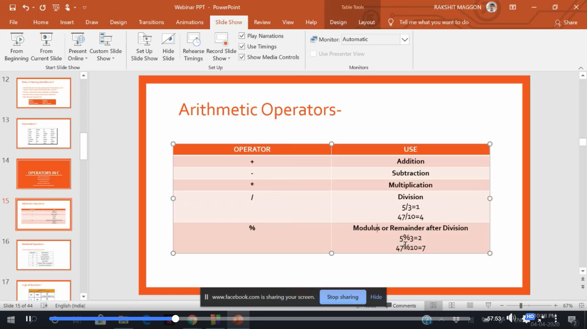
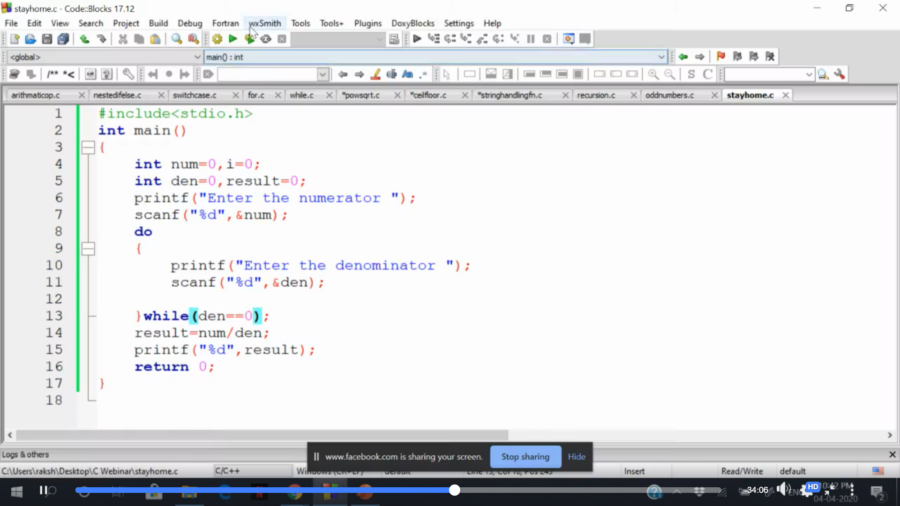

 

  

  <h3 align="center">Webinar on C programming</h3>

  

    Was conducted on 4th April 2020.
     
    <a href="https://www.facebook.com/codechefvit/videos/1334681746919673/"><strong>View Webinar»</strong></a>
     
     
    <a href="https://github.com/rmaggon6/Webinar_on_cprog/tree/master/Reference%20Material">Material</a>
    ··
    <a href="https://github.com/rmaggon6/Webinar_on_cprog/tree/master/Codes">View codes</a>
    ··
    <a href="https://github.com/rmaggon6/Webinar_on_cprog/issues">Issue</a>
  

<!-- ABOUT THE PROJECT -->
## About The Webinar 

 
    

 

 
    

####  The webinar was conducted on 4th April 2020 on CodeChef-VIT's Facebook page at 10pm . 
#### The session covered basics of C programming 
- Defination and Basic Layout  
- Input & Output in C 
- Rules of Naming in C
- Operators
- Conditional  Statements 
- Iteration 
- Functions in C
- Arrays and Strings 
  

### Prerequisites
- None 
- Webinar covers Basic of C programming 

<!-- CONTRIBUTING -->
## Contributing
Got better codes ?  Feel free to add them .  
Any contributions you make are **greatly appreciated**.

1. Fork the Project
2. Create your Feature Branch (`git checkout -b feature/AmazingFeature`)
3. Commit your Changes (`git commit -m 'Add some AmazingFeature'`)
4. Push to the Branch (`git push origin feature/AmazingFeature`)
5. Open a Pull Request

## Contact me 

-  Connect with me and share your experience.

 &nbsp;&nbsp; &nbsp;&nbsp;

## Acknowledgements
- Codechef-VIT: [Facebook](https://www.facebook.com/codechefvit) | [Website](https://www.codechefvit.com/) 

	With :heart: by <a href="https://rakshit.netlify.app/" target="_blank">Rakshit Maggon</a>

